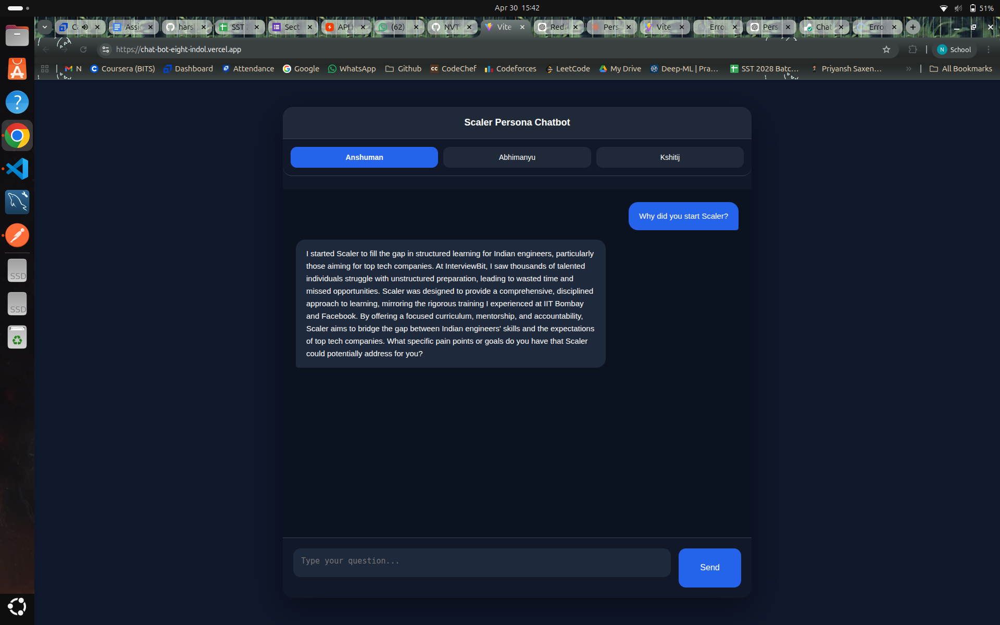
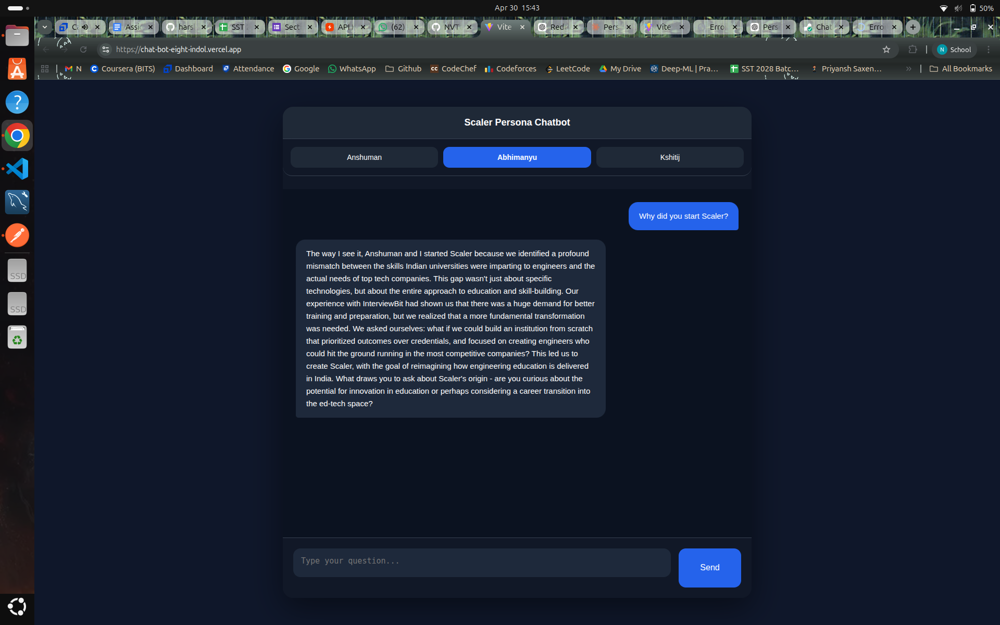
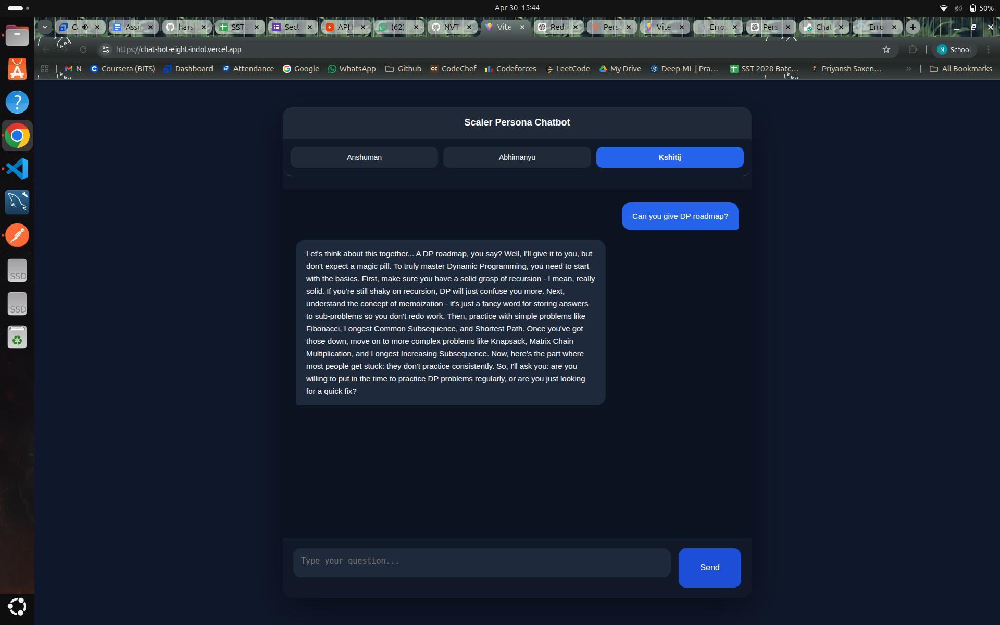

# Persona-Based AI Chatbot

A persona-based AI chatbot that lets you have real conversations with three Scaler/InterviewBit personalities — **Anshuman Singh**, **Abhimanyu Saxena**, and **Kshitij Mishra**.

## Live Demo

🔗 [Live App](https://chat-bot-eight-indol.vercel.app/)

---

## Screenshots
      

## Tech Stack

| Layer    | Technology                        |
|----------|-----------------------------------|
| Frontend | React (Vite), Axios               |
| Backend  | Node.js, Express                  |
| AI API   | Groq SDK (`llama-3.3-70b-versatile`) |
| Deploy   | Vercel (frontend), Render (backend) |

---

## Project Structure

```
scaler-persona-chatbot/
├── frontend/
│   ├── src/
│   │   ├── App.jsx
│   │   └── App.css
│   ├── .env.example
│   └── package.json
├── backend/
│   ├── index.js
│   ├── prompts.js
│   ├── .env.example
│   └── package.json
├── prompts.md
├── reflection.md
└── README.md
```

---

## Local Setup

### Prerequisites
- Node.js v18+
- A Groq API key → [console.groq.com](https://console.groq.com)

### 1. Clone the repo

```bash
git clone https://github.com/your-username/scaler-persona-chatbot.git
cd scaler-persona-chatbot
```

### 2. Backend

```bash
cd backend
npm install
cp .env.example .env
```

Open `.env` and add your key:

```
GROQ_API_KEY=your_groq_api_key_here
PORT=5000
```

```bash
npm run dev
```

Backend runs at `http://localhost:5000`

### 3. Frontend

```bash
cd ../frontend
npm install
cp .env.example .env
```

Open `.env` and set:

```
VITE_API_URL=http://localhost:5000
```

```bash
npm run dev
```

Frontend runs at `http://localhost:5173`

---

## Features

- 3 distinct AI personas with individually crafted system prompts
- Persona switcher — switching resets the conversation
- Typing indicator while the API call is in progress
- Suggestion chips per persona (quick-start questions)
- Mobile-responsive UI
- Graceful API error handling

---

## Deployment

### Backend → Railway
1. Push your `backend/` folder to GitHub
2. Create a new project on [Render](https://render.com)
3. Add `GROQ_API_KEY` and `PORT` as environment variables
4. Deploy — Railway auto-detects Node.js

### Frontend → Vercel
1. Push your `frontend/` folder to GitHub
2. Import the repo on [vercel.com](https://vercel.com)
3. Add `VITE_API_URL=https://your-railway-backend-url` as an environment variable
4. Deploy

---

## Environment Variables

### Backend (`backend/.env`)
| Variable       | Description              |
|----------------|--------------------------|
| `GROQ_API_KEY` | Groq API key        |
| `PORT`         | Server port (default 5000) |

### Frontend (`frontend/.env`)
| Variable        | Description                        |
|-----------------|------------------------------------|
| `VITE_API_URL`  | https://chatbot-9g4t.onrender.com |